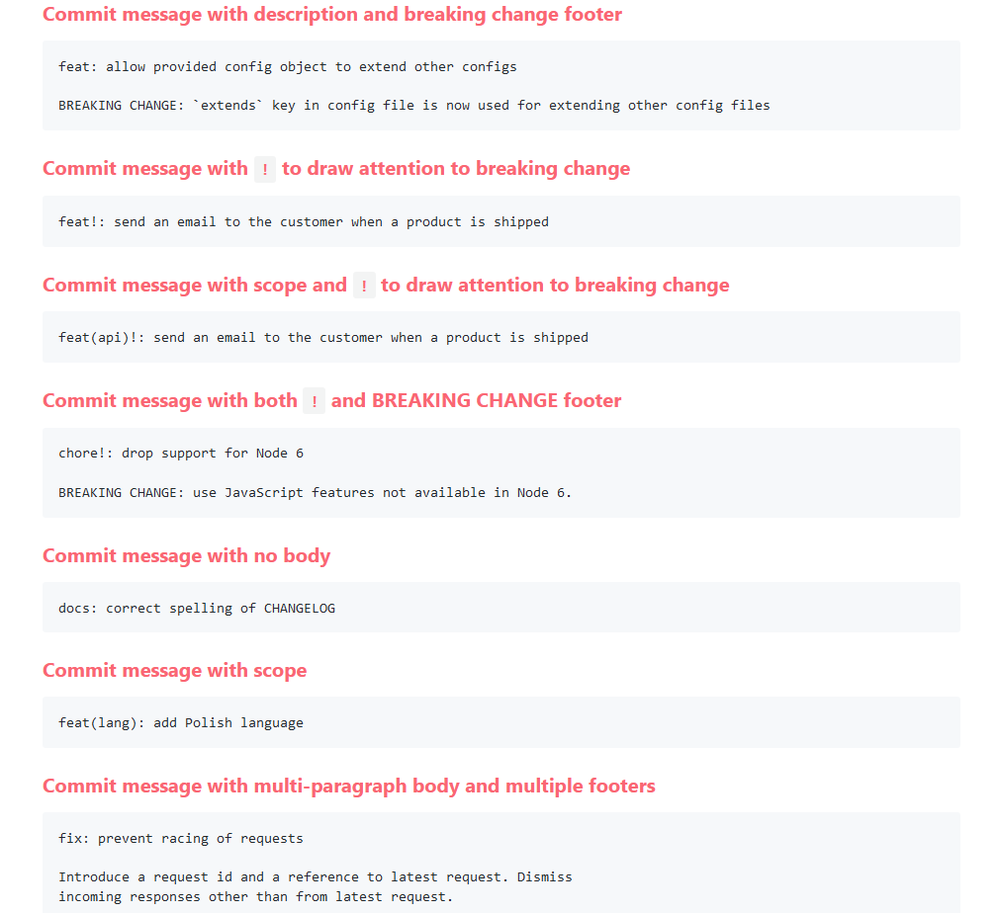

# Testing_Repo_for_Testing_Testing

GitHub Actions? Let's check them out

Process completed with exit code 5. Problem

https://github.com/TriPSs/conventional-changelog-action

## How to contribute?
At least use this tagging patterns
### Conventional commits
https://www.conventionalcommits.org/en/v1.0.0/

#### examples
https://www.conventionalcommits.org/en/v1.0.0/#examples

